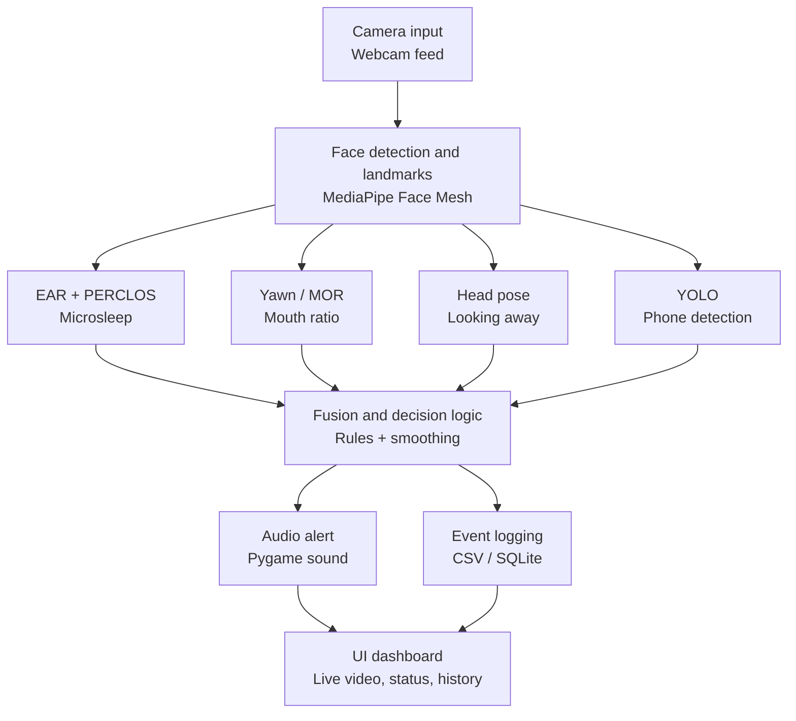

# Edge-Based Driver Drowsiness & Distraction Alert System

## 1. Problem statement
A real-time system that watches a driver's face through a webcam and raises an alert when it detects signs of drowsiness (microsleep, yawning) or distraction (looking away, phone use), so the driver can be warned before it becomes dangerous.

## 2. Architecture



## 3. Definitions (numeric thresholds)
These are starting values — you'll tune them in Week 2–5 against real test data. Write down whatever you land on here as you go.

| Condition | Definition |
|---|---|
| Microsleep (drowsy) | Eyes closed continuously for > 2.0 seconds, OR PERCLOS (% of eyes-closed frames in a rolling window) > 20% |
| Yawning | Mouth Opening Ratio (MOR) stays above threshold continuously for > 1.5 seconds |
| Distracted — looking away | Head yaw or pitch exceeds ~25° for > 1 second |
| Distracted — phone use | A cell phone is detected in frame by the object detector, with a short cooldown to avoid flicker |

## 4. Target hardware
- [ ] Laptop webcam only (default — start here)
- [ ] Laptop + Raspberry Pi / Jetson Nano (optional Week 6 stretch goal)

*(Decide and check one box before Day 2. You can always revisit this in Week 6.)*

## 5. Success metrics
- Target frame rate: ≥ 15 FPS with all detection modules running together
- Alert latency: < 1 second from condition onset to alarm sound
- Acceptable false-alarm rate: to be measured and recorded during Week 5 testing (Day 23–24)

## 6. Project structure
```
/src      - all source code (video_stream.py, face_landmarks.py, signals, fusion, etc.)
/models   - downloaded/pretrained models (YOLOv8n, etc.)
/data     - datasets used for threshold validation (MRL eye, YawDD, NTHU)
/logs     - session event logs (CSV or SQLite)
/ui       - Streamlit app files
/tests    - unit tests, especially for decide_state()
```

## 7. Tech stack
Python 3.10+, OpenCV, MediaPipe, Ultralytics YOLOv8n, Pygame, Streamlit, NumPy, SciPy. Logging via CSV or SQLite. Optional edge deployment via TFLite/ONNX on Raspberry Pi 4 / Jetson Nano.

## 8. Known limitations (fill in as you discover them)
- (e.g., accuracy may drop with glasses / poor lighting / off-angle camera — to be tested Week 5)

## 9. Setup & run instructions
*(To be completed on Day 2 and Day 28.)*