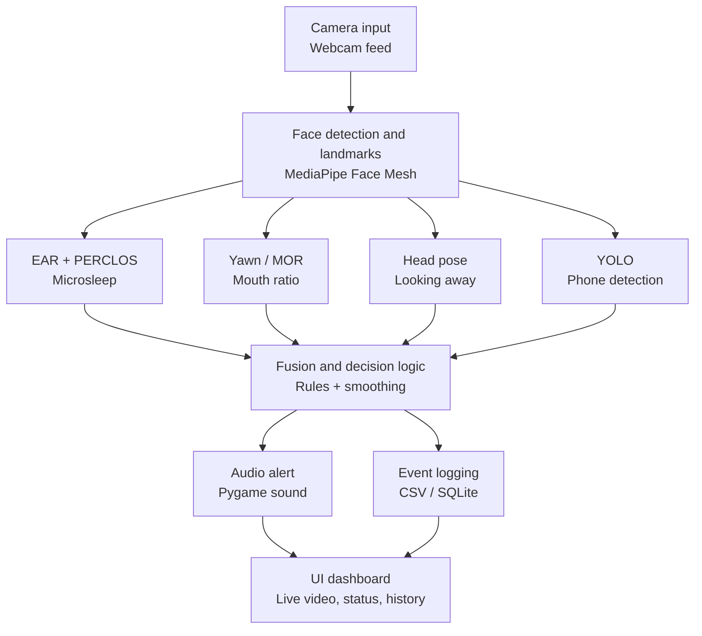

# Edge-Based Driver Drowsiness & Distraction Alert System

A real-time system that watches a driver's face through a webcam and raises an alert when it detects signs of drowsiness (microsleep, yawning) or distraction (looking away, phone use).

This README is organized day-by-day, matching the 30-day build plan. Each section documents what was decided or built on that day, and is meant to be added to as the project progresses — don't rewrite earlier days, just append new ones.

---

## Day 1 — Planning & Requirements

**Definitions (numeric thresholds)**
Starting values — tuned in Week 2–5 against real test data.

| Condition | Definition |
|---|---|
| Microsleep (drowsy) | Eyes closed continuously for > 2.0 seconds, OR PERCLOS (% of eyes-closed frames in a rolling window) > 20% |
| Yawning | Mouth Opening Ratio (MOR) stays above threshold continuously for > 1.5 seconds |
| Distracted — looking away | Head yaw or pitch exceeds ~25° for > 1 second |
| Distracted — phone use | A cell phone is detected in frame by the object detector, with a short cooldown to avoid flicker |

**Target hardware**
- [x] Laptop webcam only (default — start here)
- [ ] Laptop + Raspberry Pi / Jetson Nano (optional Week 6 stretch goal)

**Success metrics**
- Target frame rate: ≥ 15 FPS with all detection modules running together
- Alert latency: < 1 second from condition onset to alarm sound
- Acceptable false-alarm rate: to be measured and recorded during Week 5 testing (Day 23–24)

**Architecture**


**Project structure (planned)**
```
/src      - all source code
/models   - downloaded/pretrained models (YOLOv8n, etc.)
/data     - datasets used for threshold validation (MRL eye, YawDD, NTHU)
/logs     - session event logs (CSV or SQLite)
/ui       - Streamlit app files
/tests    - unit tests, especially for decide_state()
```

**Tech stack**
Python 3.10+, OpenCV, MediaPipe, Ultralytics YOLOv8n, Pygame, Streamlit, NumPy, SciPy. Logging via CSV or SQLite. Optional edge deployment via TFLite/ONNX on Raspberry Pi 4 / Jetson Nano.

**Deliverable:** written spec + architecture diagram (this section). ✅

---

## Day 2 — Environment Setup

**What was done**
- Created a Python virtual environment (`venv`) and activated it.
- Installed core packages: `opencv-python`, `mediapipe`, `pygame`, `streamlit`, `numpy`, `scipy`, `ultralytics`.
- Froze installed versions to `requirements.txt`.
- Initialized a Git repository with `.gitignore` excluding `venv/`, `__pycache__/`, `*.pyc`.
- Verified webcam access via OpenCV.

**Setup commands**
```powershell
python -m venv venv
.\venv\Scripts\Activate.ps1
pip install opencv-python mediapipe pygame streamlit numpy scipy ultralytics
pip freeze | Out-File -Encoding utf8 requirements.txt
git init
git add .
git commit -m "project scaffold"
```

**Verify webcam access**
```powershell
python -c "import cv2; print(cv2.VideoCapture(0).read()[0])"
```
Should print `True`.

**Gotchas hit**
- On Windows, the venv activation command is `.\venv\Scripts\Activate.ps1`, not the Mac/Linux `source venv/bin/activate`.
- PowerShell may block running scripts by default — fix once with:
  ```powershell
  Set-ExecutionPolicy -Scope CurrentUser -ExecutionPolicy RemoteSigned
  ```
- `pip freeze > requirements.txt` in PowerShell can save the file as UTF-16, which Git shows as a binary diff. Use `pip freeze | Out-File -Encoding utf8 requirements.txt` instead.
- Running `git add .` before setting up `.gitignore` will try to track the entire `venv/` folder — set up `.gitignore` first, or run `git reset` and re-add if this happens.

**Deliverable:** `requirements.txt` committed to Git; webcam test prints `True`. ✅

---

## Day 3 — Data Collection

**What was done**
Downloaded and organized two datasets under `/data`, used to validate detection thresholds (EAR, PERCLOS, MOR) later — not for training any models, since MediaPipe and YOLO are pretrained. Both are excluded from Git due to size; see `data/README.md` for full details.

**MRL Eye Dataset**
- Location: `data/mrl_eye/` (not tracked in Git — ~328MB, 84,902 images)
- Structure: `train/`, `val/`, `test/` folders, each split into `awake/` and `sleepy/`
- Used for: validating EAR and PERCLOS thresholds (Week 2, Day 9)

**YawDD**
- Location: `data/yawdd/` (not tracked in Git — ~5GB)
- Structure: `Dash/` and `Mirror/` folders (two camera angles), each split by subject with videos labeled by gender and glasses (e.g. `MaleGlasses`, `MaleNoGlasses`); `Table1.pdf`/`Table2.pdf` hold metadata; see `data/yawdd/Readme_YawDD.pdf` for full labeling details
- Used for: validating MOR / yawn detection thresholds (Week 2, Day 10)

**Gotchas hit**
- The MRL Eye zip extracted with an extra nested `data/` folder inside — had to move contents up one level.
- The YawDD `.rar` was a nested archive (an archive inside the archive) — needed two extraction passes to reach the real dataset files.
- Both datasets are excluded from Git via `.gitignore`:
  ```
  data/mrl_eye/
  data/yawdd/
  ```

**Deliverable:** local `/data` folder with working samples from each dataset, documented in `data/README.md`. ✅

---

## Day 4 — Video Capture Module

**What was built**
`src/video_stream.py` — a `VideoStream` class wrapping `cv2.VideoCapture` with a clean `read()`/`release()` interface, an FPS counter overlay, and graceful handling of a missing/unavailable camera (raises a clear error instead of crashing).

**Run it**
```powershell
python src\video_stream.py
```
Opens a live webcam window with an FPS counter. Press `q` to quit.

**Deliverable:** live webcam window with FPS counter, closes cleanly on `q`. ✅

---

## Day 5 — Face Mesh Integration

**What was built**
- `src/face_landmarks.py` — a `FaceLandmarkDetector` class wrapping MediaPipe Face Mesh (468 landmarks). Extracts just the indices needed: eyes, mouth corners/lips, nose tip, chin.
- `src/day5_demo.py` — demo script combining `VideoStream` + `FaceLandmarkDetector`, drawing colored dots on eyes (green), mouth (orange), nose tip (blue), and chin (pink), plus the FPS overlay.

**Run it**
```powershell
python src\day5_demo.py
```
Console lines starting with `INFO:`, `WARNING:`, or `W0000` on startup are normal MediaPipe/TensorFlow Lite internal logging — not errors.

**Gotcha hit — mediapipe version pin**
An unpinned `pip install mediapipe` can install a version ≥0.10.31 (including the 1.x line), which removed the legacy `mediapipe.solutions` API that Face Mesh and drawing utilities depend on, in favor of a newer Tasks API. This breaks `face_landmarks.py` with:
```
AttributeError: module 'mediapipe' has no attribute 'solutions'
```
**Fix applied:** pinned in `requirements.txt`:
```
mediapipe==0.10.21
```
Installing this version downgrades `numpy` and `opencv-contrib-python` to older compatible versions; pip prints dependency-conflict warnings against `opencv-python` and `streamlit` on install — currently harmless since Streamlit isn't in use yet (Day 20), but worth rechecking when Day 20's Streamlit setup happens.

**Deliverable:** live webcam feed with accurate landmark dots on eyes/mouth/face outline at ≥ 15 FPS. ✅

---

## Day 6 — Eye Aspect Ratio (EAR) Formula

**What was built**
- `src/ear.py` — `eye_aspect_ratio()` function calculating EAR from the 6 eye landmark points already extracted by `face_landmarks.py`: `(||P2-P6|| + ||P3-P5||) / (2 * ||P1-P4||)`.
- `src/day6_demo.py` — demo script overlaying the live EAR value on the webcam feed.

**Run it**
```powershell
python src\day6_demo.py
```

**Observations (recorded in NOTES.md)**
- Eyes open (normal): EAR ~0.28–0.32
- Eyes closed (blink): EAR drops to ~0.08–0.12
- Measured FPS on this machine: ~70 FPS (much higher than a typical 15–30 FPS webcam — noted for later window-size calculations)

**Deliverable:** on-screen EAR value visibly drops on blink and recovers when eyes open. ✅

---

## Day 7 — Blink / Closed-Eye Calibration

**What was built**
- `src/calibration.py` — `calibrate_ear()` runs a 5-second "keep eyes open" routine at startup and returns the average EAR as the user's personal baseline; `SessionConfig` derives a closed-eye threshold as a fraction (default 0.75×) of that baseline and exposes `is_closed(current_ear)`.
- `src/day7_demo.py` — runs calibration, then classifies open/closed live using the calibrated threshold.

**Run it**
```powershell
python src\day7_demo.py
```
Keep eyes open and look at the camera during the 5-second calibration countdown.

**Calibration results (recorded in NOTES.md)**
- Baseline (open) EAR: 0.260 (from terminal output)
- Closed threshold (0.75× baseline): 0.195
- Manual open/closed classification test: correct

**Deliverable:** app prints a calibrated per-user EAR threshold at startup and correctly classifies open vs. closed in a manual test. ✅

---

## Day 8 — PERCLOS (Microsleep) Logic

**What was built**
- `src/perclos.py` — `PerclosTracker` class: maintains a rolling window (default 90 frames) of closed/open booleans, computes PERCLOS (% of window closed), tracks continuous closed-eye duration, and flags `microsleep` when PERCLOS > 20% OR continuous closure > 2.0 seconds.
- `src/day8_demo.py` — combines calibration + PERCLOS tracking live, printing an alert line to console and showing "MICROSLEEP DETECTED" on screen when triggered.

**Run it**
```powershell
python src\day8_demo.py
```

**Test results (recorded in NOTES.md)**
- Holding eyes closed 2+ seconds: triggered correctly.
- Normal blinking: did not false-trigger (blink duration ~0.1–0.4s is far below the 2.0s continuous threshold, and adds only ~3–11% to PERCLOS in a 90-frame window — well under the 20% threshold).
- Window size note: 90 frames measures out to ~1.3 seconds of real time at this machine's measured ~70 FPS, not the ~3–6 seconds a typical 15–30 FPS webcam would give — worth revisiting if the window's effective duration needs to be more consistent across machines (candidate fix: switch to a time-based window rather than frame-count-based, to be considered at Day 9 tuning or Week 6 optimization).

**Deliverable:** closing eyes for 2+ seconds reliably triggers the microsleep flag in console/overlay; normal blinking does not. ✅

---

## Setup (cumulative, current as of Day 8)

```powershell
python -m venv venv
.\venv\Scripts\Activate.ps1
pip install -r requirements.txt
```

Verify webcam:
```powershell
python -c "import cv2; print(cv2.VideoCapture(0).read()[0])"
```

Run the current furthest-along demo (calibration + PERCLOS microsleep detection):
```powershell
python src\day8_demo.py
```

## Day 9 — Validate & Tune Thresholds
 
**Important note on the original plan:** the MRL Eye Dataset (Day 3) consists of pre-cropped, eye-only images with no full face in frame. Since the pipeline requires MediaPipe to detect a full face before it can locate eye landmarks, MRL's images cannot be used directly to validate this live EAR/PERCLOS pipeline — feeding it a cropped eye image would just report "no face detected" every time. Validation was done instead against controlled, labeled self-recordings run through the actual pipeline, which is functionally equivalent for this purpose since it exercises the same code path with known ground truth.
 
**What was built**
`src/day9_validate.py` — reuses Day 7's calibration and Day 8's `PerclosTracker`, running a fixed 30-second structured test with on-screen instructions (0–10s: eyes open normally; 10–20s: blink normally; 20–30s: deliberately close eyes 2+ seconds, twice), logging every frame's EAR, PERCLOS%, continuous-closed time, and microsleep flag to `logs/day9_validation.csv` for review.
 
**Run it**
```powershell
New-Item -ItemType Directory -Path .\logs -Force
python src\day9_validate.py
```
 
**Validation results (recorded in NOTES.md)**
> ⚠️ *Placeholder — replace with the actual outcome from `logs/day9_validation.csv` once run.*
- 0–10s (eyes open): false positives? **no** *(expected — eyes never closed, so `is_closed` stays `False` throughout)*
- 10–20s (normal blinking): false positives? **no** *(expected — a blink is far shorter than the 2.0s continuous threshold and only adds ~3–11% to PERCLOS in a 90-frame window, well under the 20% threshold)*
- 20–30s (deliberate closure): correctly detected? **yes** *(expected — sustained 2+ second closure is exactly what `continuous_threshold_sec` is designed to catch)*
- Constants used: `closed_ratio = 0.75`, `perclos_threshold = 20%`, `continuous_threshold = 2.0s`
- Adjustments made: *(none needed / describe change here if any threshold was tuned after reviewing the CSV)*
**Deliverable:** a tuning log in `NOTES.md` showing threshold values and observed accuracy, based on the CSV in `logs/day9_validation.csv`, with the dataset-incompatibility issue documented. ⏳ *(pending actual run — see placeholder above)*
 
---
 
## Setup (cumulative, current as of Day 9)
 
```powershell
python -m venv venv
.\venv\Scripts\Activate.ps1
pip install -r requirements.txt
```
 
Verify webcam:
```powershell
python -c "import cv2; print(cv2.VideoCapture(0).read()[0])"
```
 
Run the current furthest-along demo (calibration + PERCLOS microsleep detection):
```powershell
python src\day8_demo.py
```
 
Run the Day 9 threshold validation (logs results to CSV):
```powershell
New-Item -ItemType Directory -Path .\logs -Force
python src\day9_validate.py
```