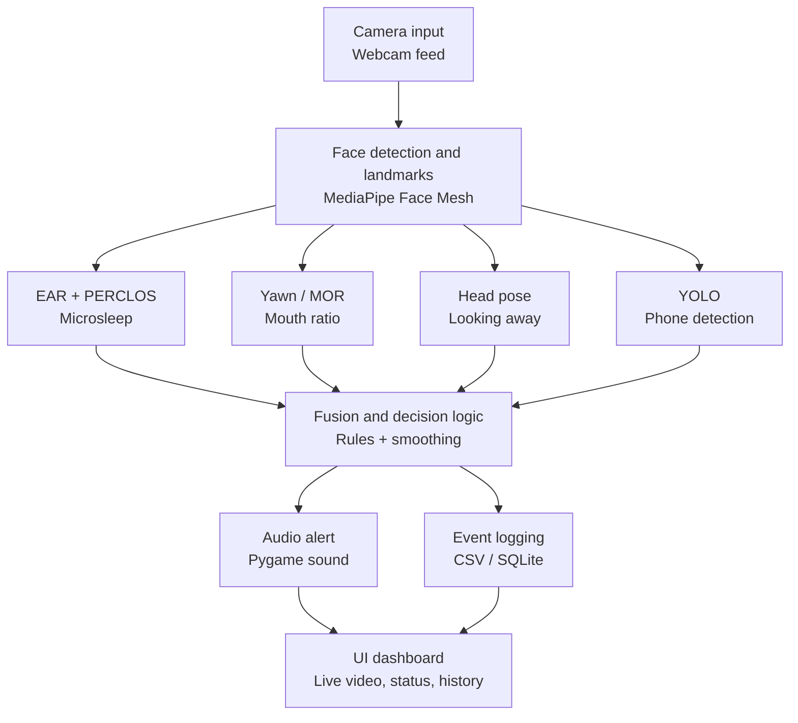

# Edge-Based Driver Drowsiness & Distraction Alert System

A real-time system that watches a driver's face through a webcam and raises an alert when it detects signs of drowsiness (microsleep, yawning) or distraction (looking away, phone use).

This README is organized day-by-day, matching the 30-day build plan. Each section documents what was decided or built on that day, and is meant to be added to as the project progresses — don't rewrite earlier days, just append new ones.

---

## Day 1 — Planning & Requirements

**Definitions (numeric thresholds)**
Starting values — tuned in Week 2–5 against real test data.

| Condition | Definition |
|---|---|
| Microsleep (drowsy) | Eyes closed continuously for > 2.0 seconds, OR PERCLOS (% of eyes-closed frames in a rolling window) > 20% |
| Yawning | Mouth Opening Ratio (MOR) stays above threshold continuously for > 1.5 seconds |
| Distracted — looking away | Head yaw or pitch exceeds ~25° for > 1 second |
| Distracted — phone use | A cell phone is detected in frame by the object detector, with a short cooldown to avoid flicker |

**Target hardware**
- [x] Laptop webcam only (default — start here)
- [ ] Laptop + Raspberry Pi / Jetson Nano (optional Week 6 stretch goal)

**Success metrics**
- Target frame rate: ≥ 15 FPS with all detection modules running together
- Alert latency: < 1 second from condition onset to alarm sound
- Acceptable false-alarm rate: to be measured and recorded during Week 5 testing (Day 23–24)

**Architecture**


**Project structure (planned)**
```
/src      - all source code
/models   - downloaded/pretrained models (YOLOv8n, etc.)
/data     - datasets used for threshold validation (MRL eye, YawDD, NTHU)
/logs     - session event logs (CSV or SQLite)
/ui       - Streamlit app files
/tests    - unit tests, especially for decide_state()
```

**Tech stack**
Python 3.10+, OpenCV, MediaPipe, Ultralytics YOLOv8n, Pygame, Streamlit, NumPy, SciPy. Logging via CSV or SQLite. Optional edge deployment via TFLite/ONNX on Raspberry Pi 4 / Jetson Nano.

**Deliverable:** written spec + architecture diagram (this section). ✅

---

## Day 2 — Environment Setup

**What was done**
- Created a Python virtual environment (`venv`) and activated it.
- Installed core packages: `opencv-python`, `mediapipe`, `pygame`, `streamlit`, `numpy`, `scipy`, `ultralytics`.
- Froze installed versions to `requirements.txt`.
- Initialized a Git repository with `.gitignore` excluding `venv/`, `__pycache__/`, `*.pyc`.
- Verified webcam access via OpenCV.

**Setup commands**
```powershell
python -m venv venv
.\venv\Scripts\Activate.ps1
pip install opencv-python mediapipe pygame streamlit numpy scipy ultralytics
pip freeze | Out-File -Encoding utf8 requirements.txt
git init
git add .
git commit -m "project scaffold"
```

**Verify webcam access**
```powershell
python -c "import cv2; print(cv2.VideoCapture(0).read()[0])"
```
Should print `True`.

**Gotchas hit**
- On Windows, the venv activation command is `.\venv\Scripts\Activate.ps1`, not the Mac/Linux `source venv/bin/activate`.
- PowerShell may block running scripts by default — fix once with:
  ```powershell
  Set-ExecutionPolicy -Scope CurrentUser -ExecutionPolicy RemoteSigned
  ```
- `pip freeze > requirements.txt` in PowerShell can save the file as UTF-16, which Git shows as a binary diff. Use `pip freeze | Out-File -Encoding utf8 requirements.txt` instead.
- Running `git add .` before setting up `.gitignore` will try to track the entire `venv/` folder — set up `.gitignore` first, or run `git reset` and re-add if this happens.

**Deliverable:** `requirements.txt` committed to Git; webcam test prints `True`. ✅

---

## Day 3 — Data Collection

**What was done**
Downloaded and organized two datasets under `/data`, used to validate detection thresholds (EAR, PERCLOS, MOR) later — not for training any models, since MediaPipe and YOLO are pretrained. Both are excluded from Git due to size; see `data/README.md` for full details.

**MRL Eye Dataset**
- Location: `data/mrl_eye/` (not tracked in Git — ~328MB, 84,902 images)
- Structure: `train/`, `val/`, `test/` folders, each split into `awake/` and `sleepy/`
- Used for: validating EAR and PERCLOS thresholds (Week 2, Day 9)

**YawDD**
- Location: `data/yawdd/` (not tracked in Git — ~5GB)
- Structure: `Dash/` and `Mirror/` folders (two camera angles), each split by subject with videos labeled by gender and glasses (e.g. `MaleGlasses`, `MaleNoGlasses`); `Table1.pdf`/`Table2.pdf` hold metadata; see `data/yawdd/Readme_YawDD.pdf` for full labeling details
- Used for: validating MOR / yawn detection thresholds (Week 2, Day 10)

**Gotchas hit**
- The MRL Eye zip extracted with an extra nested `data/` folder inside — had to move contents up one level.
- The YawDD `.rar` was a nested archive (an archive inside the archive) — needed two extraction passes to reach the real dataset files.
- Both datasets are excluded from Git via `.gitignore`:
  ```
  data/mrl_eye/
  data/yawdd/
  ```

**Deliverable:** local `/data` folder with working samples from each dataset, documented in `data/README.md`. ✅

---

## Day 4 — Video Capture Module

**What was built**
`src/video_stream.py` — a `VideoStream` class wrapping `cv2.VideoCapture` with a clean `read()`/`release()` interface, an FPS counter overlay, and graceful handling of a missing/unavailable camera (raises a clear error instead of crashing).

**Run it**
```powershell
python src\video_stream.py
```
Opens a live webcam window with an FPS counter. Press `q` to quit.

**Deliverable:** live webcam window with FPS counter, closes cleanly on `q`. ✅

---

## Day 5 — Face Mesh Integration

**What was built**
- `src/face_landmarks.py` — a `FaceLandmarkDetector` class wrapping MediaPipe Face Mesh (468 landmarks). Extracts just the indices needed: eyes, mouth corners/lips, nose tip, chin.
- `src/day5_demo.py` — demo script combining `VideoStream` + `FaceLandmarkDetector`, drawing colored dots on eyes (green), mouth (orange), nose tip (blue), and chin (pink), plus the FPS overlay.

**Run it**
```powershell
python src\day5_demo.py
```
Console lines starting with `INFO:`, `WARNING:`, or `W0000` on startup are normal MediaPipe/TensorFlow Lite internal logging — not errors.

**Gotcha hit — mediapipe version pin**
An unpinned `pip install mediapipe` can install a version ≥0.10.31 (including the 1.x line), which removed the legacy `mediapipe.solutions` API that Face Mesh and drawing utilities depend on, in favor of a newer Tasks API. This breaks `face_landmarks.py` with:
```
AttributeError: module 'mediapipe' has no attribute 'solutions'
```
**Fix applied:** pinned in `requirements.txt`:
```
mediapipe==0.10.21
```
Installing this version downgrades `numpy` and `opencv-contrib-python` to older compatible versions; pip prints dependency-conflict warnings against `opencv-python` and `streamlit` on install — currently harmless since Streamlit isn't in use yet (Day 20), but worth rechecking when Day 20's Streamlit setup happens.

**Deliverable:** live webcam feed with accurate landmark dots on eyes/mouth/face outline at ≥ 15 FPS. ✅

---

## Setup (cumulative, current as of Day 5)

```powershell
python -m venv venv
.\venv\Scripts\Activate.ps1
pip install -r requirements.txt
```

Verify webcam:
```powershell
python -c "import cv2; print(cv2.VideoCapture(0).read()[0])"
```